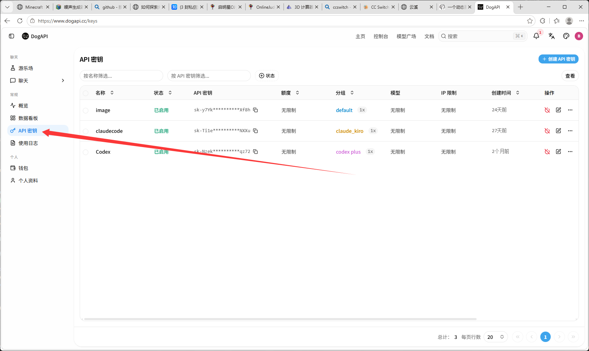
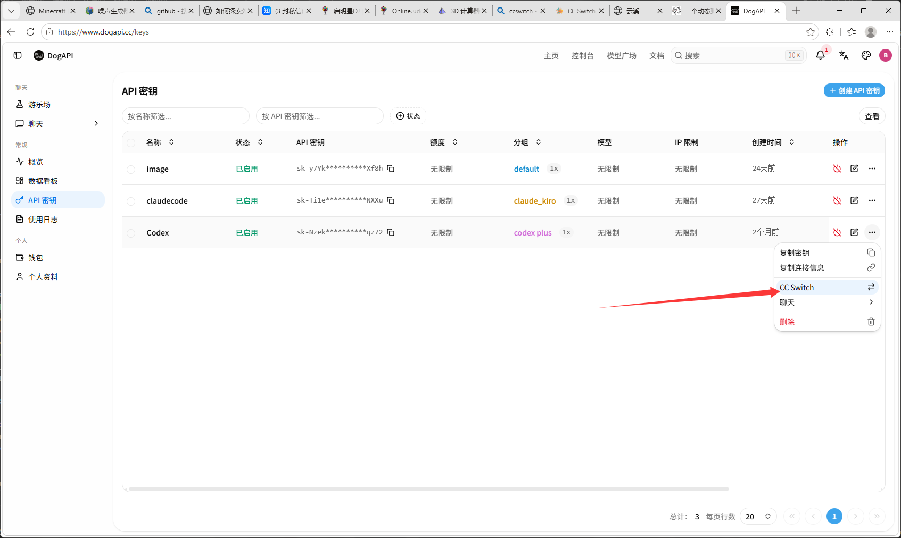

---
title: 国外AI使用
description: 国外AI使用
sidebar:
  label: 国外AI使用
  order: 1
---

## 使用中专站
  由于用正版的比较难搞，需要一直挂着梯子使用，不然容易封号，直接打水漂，而且需要外国支付方式Visa，万事达等
  可以选择中专站（但是这个水准很拉，可能给你惨点大豆脑，降智）
  老登只能推荐几个用过的，也可以去外面找找，建议少充点，试试水再用
## 推荐
  https://www.dogapi.cc/dashboard/overview
  这个目前关闭注册了
  uuapi.io
  www.dieqiyun.top
  这两个我没用过，大三的推荐的
## 使用教程
  下个CCSwitch（轮椅）https://ccswitch.io/zh/download
  
  想用什么ai自己配，这里拿gpt做演示

  先下载codex
  https://openai.com/zh-Hans-CN/codex/
  开梯子下载
  
  然后就行了，重启codex就能用了
  遇到问题可以找学长问问