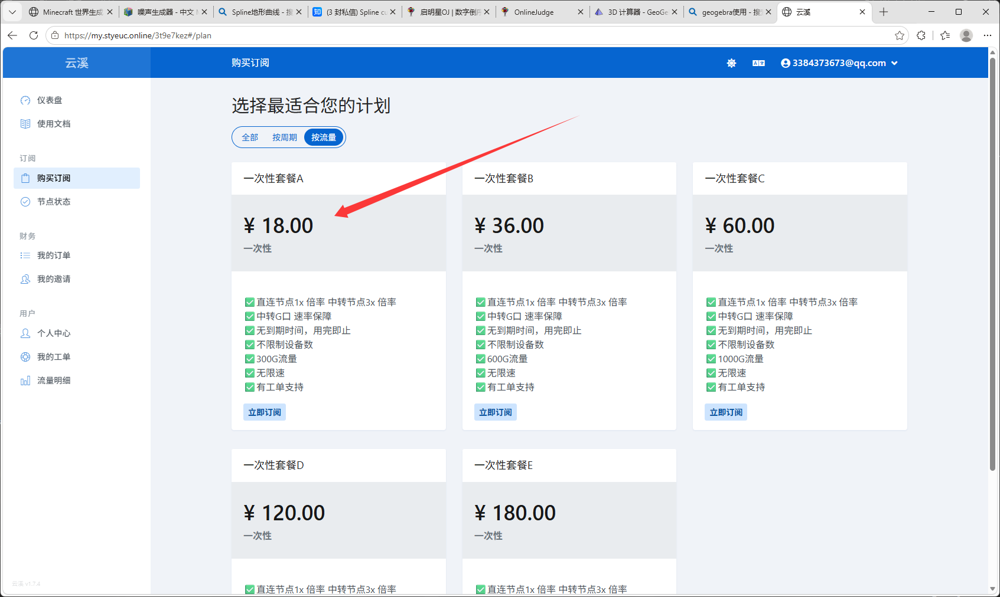
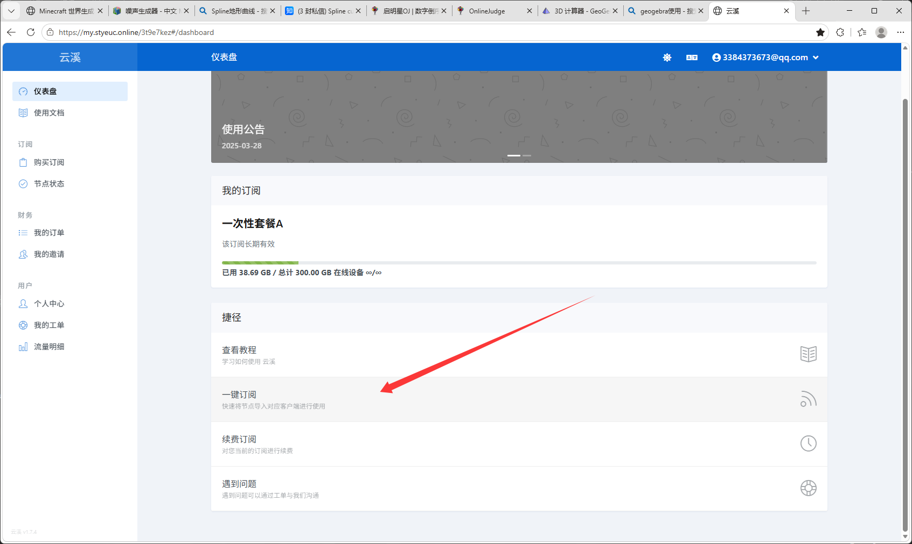
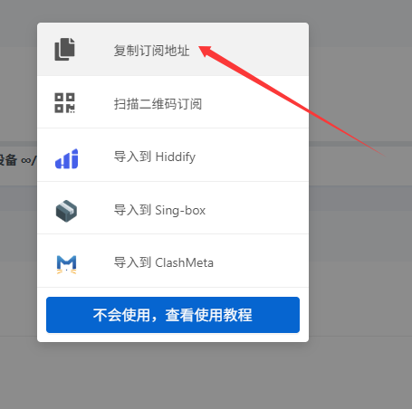
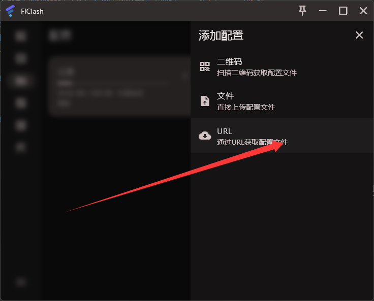

## 使用前说明

部分海外网站可能存在地区或网络访问限制。下面记录的是个人使用过的工具和配置流程，仅作为经验分享。请先确认所在地区的法律法规、学校或公司的网络规定，以及相关服务的使用条款。

## 网络服务推荐

目前记录的服务入口：

[打开服务管理页面](https://my.styeuc.online/3t9e7kez#/dashboard)

个人使用感受是速度一般，但可用流量相对充足。服务的稳定性、价格和可用地区可能随时变化，使用前请自行确认。

## Windows 客户端配置

### 1. 下载客户端

可以从下面的页面下载 Windows 客户端：

[下载 FlClash Windows 客户端](https://66.92.249.95/h4g5634ty/html/flclash/flclash-windows.html)

### 2. 复制订阅地址

在服务管理页面中找到订阅 URL，复制完整地址。

### 3. 导入订阅

打开客户端，将订阅 URL 粘贴到订阅管理或配置导入区域，然后保存并更新配置。

### 4. 选择配置并连接

选择刚刚导入的配置，更新节点列表后再选择节点连接。连接成功后，可以先打开普通网页确认网络是否正常。

## 排查建议

- 订阅更新失败时，先确认 URL 是否完整，并检查网络连接。
- 节点无法连接时，可以更换节点后再次测试。
- 浏览器仍然无法访问时，检查客户端是否处于运行状态，以及系统代理是否已经启用。
- 不使用时及时关闭客户端或系统代理，避免影响其他网络应用。
